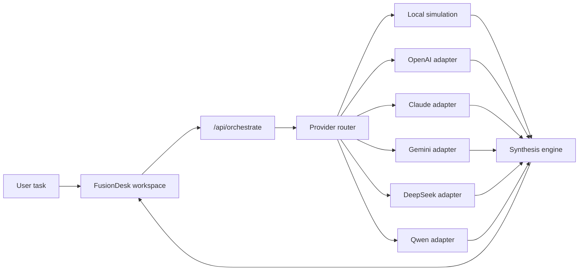

# FusionDesk AI Architecture

FusionDesk AI separates the product experience from model credentials. The browser renders the agent workspace and sends orchestration requests to a local Node.js server. The server decides whether to use mock intelligence or real provider adapters.

## Flow

## Agent Roles

- Strategy Agent: clarifies the core pain point and decomposes the task.
- Builder Agent: creates implementation steps and reusable artifacts.
- Reviewer Agent: compares model outputs and detects risks.
- Verifier Agent: proposes tests, logs, screenshots and evidence.
- Publisher Agent: formats the final result for GitHub, demos and evaluation forms.

## Provider Strategy

The project supports two modes:

- `FUSION_USE_REAL_AI=false`: deterministic local simulation for public demos.
- `FUSION_USE_REAL_AI=true`: real provider calls when API keys are configured.

All API keys stay in `.env` and are read by `server.mjs`. The browser never receives secret values.
